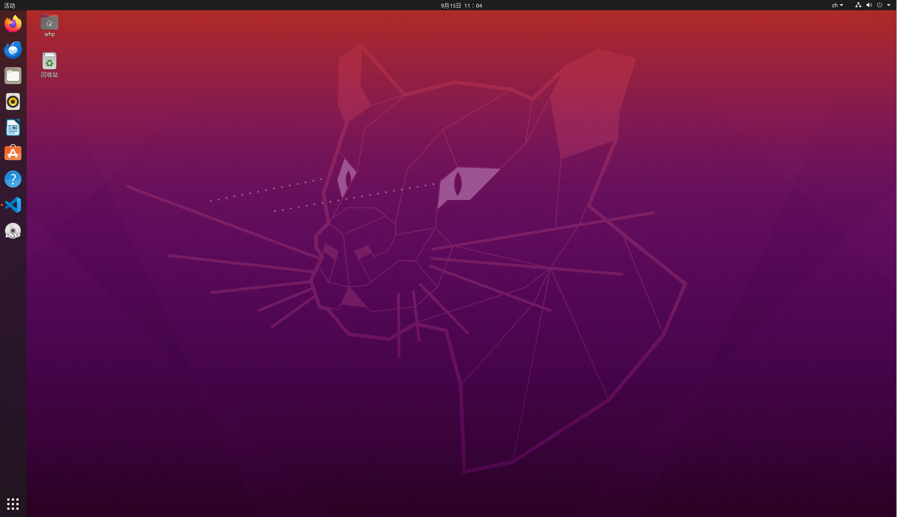

# Task01

##  1.**按照[嘿黑哥](https://www.bilibili.com/video/BV1M94y1U7nc/?spm_id_from=333.337.search-card.all.click)教程进行配置，没有报错.** 
 ***
##  2.**_But there are two  little obstacles._**
      For the first one,I can't use the source from Tsing Hua because of the Internet's fault.Thanks to our team leader,I successively use the source from USTC. 

      The next question came from how to uodate and download files from Github.So I learned this part from 廖雪峰.com,which acknoledeged how to fork and download code.
      except these things, I also learned to use terminal by team's video,and get a little understanding of computer vision.
 ***
##  3.Here is the screenshot of ubuntu.

